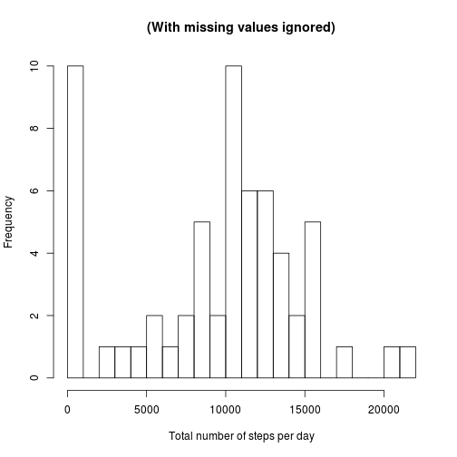
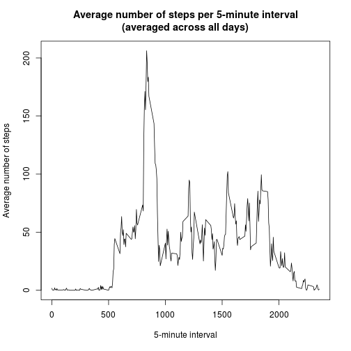
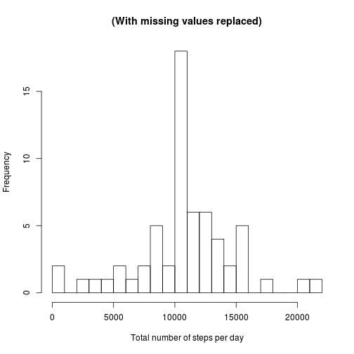
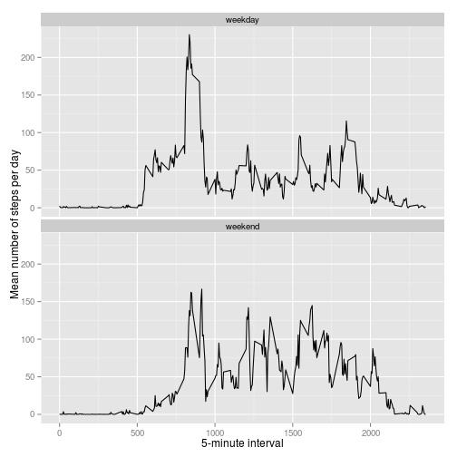

## Loading libraries and initializing variables

```r
library(dplyr)
library(ggplot2)

zipFile <- "activity.zip"
csvFile <- "activity.csv"
```


## Loading and preprocessing the data

```r
if (!file.exists(csvFile)) {
	if (file.exists(zipFile)) {
		unzip(zipFile)
	} else {
		stop(paste("File", zipFile, "not found. Exiting."))
	}
}

activity <- read.csv(csvFile)
activity$date <- as.Date(activity$date, "%Y-%m-%d")
```


## What is mean total number of steps taken per day?

```r
stepsPerDay <- activity %>%
				group_by(date) %>%
				summarise(steps = sum(steps, na.rm = TRUE))

hist(stepsPerDay$steps, xlab = "Total number of steps per day",
	 main = "(With missing values ignored)", breaks = 30)
```

 

```r
stepsPerDayMean <- mean(stepsPerDay$steps, na.rm = TRUE)
print(paste("Mean of the total number of steps per day :", stepsPerDayMean))
```

```
## [1] "Mean of the total number of steps per day : 9354.22950819672"
```

```r
stepsPerDayMedian <- median(stepsPerDay$steps, na.rm = TRUE)
print(paste("Median of the total number of steps per day :", stepsPerDayMedian))
```

```
## [1] "Median of the total number of steps per day : 10395"
```


## What is the average daily activity pattern?

```r
stepsPerIntervalMean <- activity %>%
						group_by(interval) %>%
						summarise(mean = mean(steps, na.rm = TRUE))

with(stepsPerIntervalMean, {
	plot(x = interval, y = mean, type = "l", xlab = "5-minute interval"
		 , ylab = "Average number of steps"
		 , main = "Average number of steps per 5-minute interval\n(averaged across all days)")
})
```

 

```r
maxStepsInterval <- stepsPerIntervalMean[which(max(stepsPerIntervalMean$mean) 
											   == stepsPerIntervalMean$mean), ]$interval
```
The 5-minute interval which as the highest mean number of steps is the interval that starts at 835 minutes.

## Imputing missing values
### The missing values will be filled in by the average number of steps for that 5-minute interval.

```r
naStepsNumber <- sum(is.na(activity$steps))
print(paste("The number of missing values for the steps variable is :", naStepsNumber))
```

```
## [1] "The number of missing values for the steps variable is : 2304"
```

```r
noNaActivity <- activity %>%
					left_join(stepsPerIntervalMean, by = "interval")
noNaActivity$steps[is.na(noNaActivity$steps)] <- noNaActivity$mean[is.na(noNaActivity$steps)]
noNaActivity <- noNaActivity %>% select(steps, date, interval)
```
### Using the dataset with missing values replaced, calculate the mean and median of the total number of steps per day

```r
noNaStepsPerDay <- noNaActivity %>%
				group_by(date) %>%
				summarise(steps = sum(steps))

hist(noNaStepsPerDay$steps, xlab = "Total number of steps per day", 
	main = "(With missing values replaced)",
	breaks = 30)
```

 

```r
noNaStepsPerDayMean <- mean(noNaStepsPerDay$steps)
print(paste("Mean of the total number of steps per day (with missing values replaced) :"
		, noNaStepsPerDayMean))
```

```
## [1] "Mean of the total number of steps per day (with missing values replaced) : 10766.1886792453"
```

```r
noNaStepsPerDayMedian <- median(noNaStepsPerDay$steps)
print(paste("Median of the total number of steps per day (with missing values replaced) :"
		, noNaStepsPerDayMedian))
```

```
## [1] "Median of the total number of steps per day (with missing values replaced) : 10766.1886792453"
```
The mean and median number of steps per day are higher with the missing values replaced by the average for the 5-minute interval. The mean goes from 9354.23 to 10766.19 and the median from 10395 to 10766.19.

This is to be expected because in the first section, the missing values where ignored. This was the equivalent of replacing all the missing values with zeroes when calculating the number of steps per day. With the missing values replaced by the mean for the interval, the mean and media have to be higher. The difference can be clearly seen by comparing the previous histogram with the first one.

Another difference is that the mean and the median are now equal. This is because replacing the missing values with the mean for the interval reduces the data diversity. To mitigate that effect, it would be possible to ignore the days where there is only or mostly missing values. Only the remaining days would have the missing values replaced and would be used for the analysis.
 
## Are there differences in activity patterns between weekdays and weekends?

```r
noNaActivity$day[as.POSIXlt(noNaActivity$date)$wday %in% c(0,6)] <- 'weekend'
noNaActivity$day[as.POSIXlt(noNaActivity$date)$wday >= 1 & as.POSIXlt(noNaActivity$date)$wday <= 5] <- 'weekday'
noNaActivity$day <- as.factor(noNaActivity$day)

stepsPerIntervalDayMean <- noNaActivity %>%
						group_by(interval, day) %>%
						summarise(mean = mean(steps))

graph <- ggplot(stepsPerIntervalDayMean, aes(x = interval, y = mean)) + geom_line()
graph <- graph + facet_wrap(~day, nrow=2)
graph <- graph + labs(x = "5-minute interval", y = "Mean number of steps per day")
print(graph)
```

 

